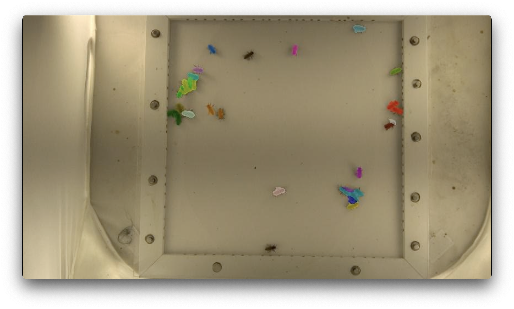

Week 3 was filled with a variety of tasks. One such task was that I was able to raise the XMem pull request and get in contact with the creator
to review my changes. This was exciting because it is one of the largest open source projects I have contributed to. Since it has over 1.2k stars,
100+ forks, and the fact that is heavily utilized in projects such as Segment Anything by Meta, I was able to make a meaningful contribuition
to further the research community. For archival purposes, I have provided a list of my contributions to the project:
With increased MPS support from PyTorch, this feature will be necessary for users to run XMem on-device.
- Updated code to use PyQt6
- Added checks for MPS instead of just CUDA
- Added code to correctly start the timeout sequence for the video player
- Tracking memory usage is not supported by PyTorch, so I patched a temporary fix where I just return their currently used memory, until PyTorch updates their MPS support
- Changed the shortcuts to be Cmd/Cntrl + (1 - N) and I also added a new widget to the GUI where users could manually select the object they wanted to select/edit. The keys 1 through N did not work if users were on Mac because of way Qt handles Mac shortcuts. Along with this, if users wanted to select more than 9 objects they previously could not.
    - Actually fixed this issue by adding self.setFocusPolicy(Qt.FocusPolicy.StrongFocus)
    - Forces the computer to give focus to XMem
- Added widget to export video of overlayed frames.

My second major task was to run XMem on some demo videos with a few honeybees and study how it behaves. After running the model, I was a bit
dissapointed because although it worked well for tracking a single bee, it was very bad when I attempted to track 27 bees. The masks that
it attempted to propagate would often get mixed up and jump from bee to bee, or sometimes there would be honeybees that would just lose their
segmentation mask. The primary issue was that when the bees were in clusters, the model was having trouble differentiating them. I have
provided an image to display this issue. As you can see, in the top left multiple bees have yellow and green masks when this should not be the case.
Similarly in the bottom right there are three bees with the same light blue mask, and in the middle right there are two bees with red masks.

Dr. Peleg and I decided that this upcoming week I would attempt to try both my and her ideas of improving the model, but we would place a cap
on our attempts after two weeks so that we wouldn't waste time. Some of my ideas to improve the system were:
  - using an object tracking system might be easier to isolate specific bees
  - creating better masks, but this might not fix anything because the issue is that the masks are changing from bee to bee

Finally Dr. Peleg and I talked about my abstract for my upcoming submission to SACNAS. She provided some suggestions that I will implement before
July 14th deadline.
